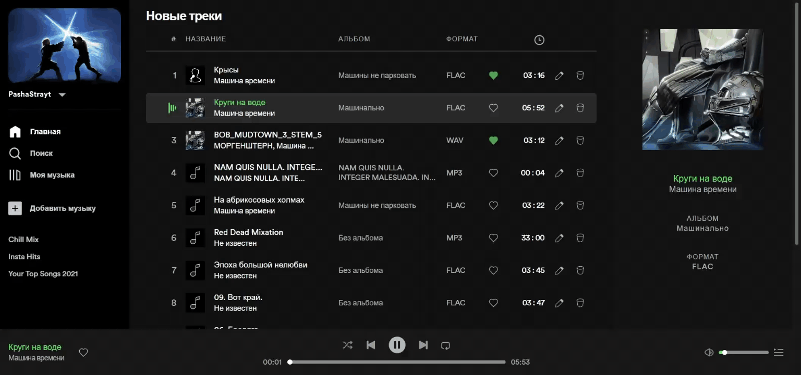

# Spotify Clone 🎶🎧

Clone of popular app with supporting such formats: .flac, .wav, .m4a и .ogg. 
// Клон популярного приложения с поддержкой форматов: .flac, .wav, .m4a и .ogg.

## Development progress in percent // Прогресс разработки в процентах

App already works, but some pages, buttons, etc. haven't finished yet 
// Приложение уже работает, но пока еще не закончены некоторые страницы, кнопки и пр.

## Preview

Listen, revind, play, pause music! 
// Слушайте, перематывайте, проигрывайте музыку!

You can also edit, delete and make favourite any song! 
// Вы также можете редактировать, удалять и добавлять в избранное любые треки!

And, of course, you can add / create songs, albums, playlists and singers to a database 
// И, конечно, вы можете добавлять / создавать треки, альбомы, плейлисты и исполнителей в базу данных

## Stack
### Frontend
<ul>
  <li>React</li>
  <li>MobX</li>
  <li>SCSS modules</li>
</ul>

### Backend
<ul>
  <li>PostgreSQL</li>
  <li>Express JS</li>
</ul>

## In developing // В разработке
<ul>
  <li><s>Панель создания контента</s></li>
  <ul>
    <li><s>Загрузка и первоначальное редактирование треков</s></li>
    <li><s>Создание альбома</s></li>
    <li><s>Создание плейлиста</s></li>
    <li><s>Создание исполнителя</s></li>
  </ul>
  <li><s>Регистрация и авторизация</s></li>
  <li>Страницы</li>
  <ul>
    <li><s>Главная</s></li>  
    <ul>
      <li><s>Треки</s></li>
      <li>Альбомы</li>
      <li>Плейлисты</li>
    </ul>
    <li>Поиск</li>
    <li><s>Универсальная страница альбома</s></li>
    <li>Универсальная страница плейлиста</li>
  </ul>
  <li>AudioPanel в нижней части приложения для управления воспроизведением и звуком</li>
  <ul>
    <li><s>Воспроизведение / пауза</s></li>
    <li><s>Предыдущий трек</s></li>
    <li><s>Следующий трек</s></li>
    <li><s>Перемешать очередь</s></li>
    <li><s>Зациклить трек</s></li>
    <li><s>Полоса и кнопка громкости</s></li>
    <li>Рабочая кнопка добавления / удаления трека из избранного</li>
  </ul>
  <li>Воспроизведение очереди с начала, если доиграл последний трек, и была нажата кнопка воспроизведения</li>
</ul>
