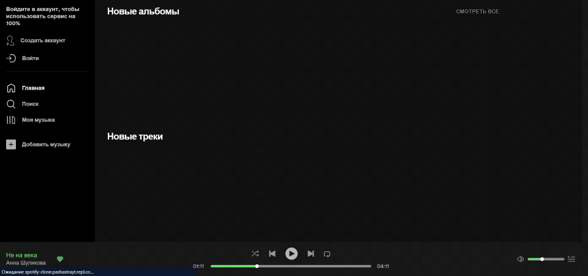

  
# Spotify Clone 🎶🎧

Clone of popular app with supporting such formats: .flac, .wav, .m4a and .ogg. 
// Клон популярного приложения с поддержкой форматов: .flac, .wav, .m4a и .ogg.

## Development progress in percent // Прогресс разработки в процентах

App's almost ready and works fine, but it maybe will get updates for fix some bugs and reworking components in the future 
// Приложение почти готово и прекрасно работает, но возможно еще будет обновляться в будущем

<h2><a href="https://spotify-clone-pashastrayt.vercel.app/home">ACTUAL DEPLOY LINK</a><h2>

click above text link or below image link 
// нажми на текст выше или на картинку ниже

## Preview

Listen, revind, play, pause music! 
// Слушайте, перематывайте, проигрывайте музыку!

You can also edit, delete and make favourite any song! 
// Вы также можете редактировать, удалять и добавлять в избранное любые треки!

And, of course, you can add / create songs, albums, playlists and singers to a database 
// И, конечно, вы можете добавлять / создавать треки, альбомы, плейлисты и исполнителей в базу данных

## Stack
### Frontend
<ul>
  <li>React</li>
  <li>MobX</li>
  <li>SCSS modules</li>
</ul>

### Backend
<ul>
  <li>PostgreSQL</li>
  <li>Express JS</li>
</ul>
  
## Deploy local on your PC // Разверните локально на своем ПК

For this you need create <code>.env</code> file in the <code>backend</code> directory and put your variables values 
// Для этого вам необходимо создать <code>.env</code> файл в папке <code>backend</code> и поместить туда свои значения

<pre>
  <code>
    PORT=
    DB_NAME=
    DB_USER=
    DB_PASSWORD=
    DB_HOST=
    DB_PORT=
    SECRET_KEY=
  </code>
</pre>

## In developing (todo list) // В разработке
<ul>
  <li><s>Панель создания контента</s></li>
  <ul>
    <li><s>Загрузка и первоначальное редактирование треков</s></li>
    <li><s>Создание альбома</s></li>
    <li><s>Создание плейлиста</s></li>
    <li><s>Создание исполнителя</s></li>
  </ul>
  <li><s>Регистрация и авторизация</s></li>
  <li>Страницы</li>
  <ul>
    <li><s>Главная</s></li>  
    <ul>
      <li><s>Треки</s></li>
      <li><s>Альбомы</s></li>
      <li>Плейлисты</li>
    </ul>
    <li><s>Избранное</s></li> 
    <ul>
      <li><s>Треки</s></li>
      <li><s>Альбомы</s></li>
      <li>Плейлисты</li>
    </ul>
    <li><s>Поиск</s></li> 
    <ul>
      <li><s>Треки</s></li>
      <li><s>Альбомы</s></li>
      <li>Плейлисты</li>
      <li>Исполнители</li>
    </ul>
    <li><s>Универсальная страница альбома</s></li>
    <li>Универсальная страница плейлиста</li>
    <li>Универсальная страница исполнителя</li>
    <li><s>Добавление контента</s></li>  
    <ul>
      <li><s>Треки</s></li>
      <li><s>Альбомы</s></li>
      <li><s>Плейлисты</s></li>
      <li><s>Исполнители</s></li>
    </ul>
  </ul>
  <li><s>AudioPanel в нижней части приложения для управления воспроизведением и звуком</s></li>
  <ul>
    <li><s>Рабочая кнопка добавления / удаления трека из избранного</s></li>
    <li><s>Воспроизведение / пауза</s></li>
    <li><s>Предыдущий трек</s></li>
    <li><s>Следующий трек</s></li>
    <li><s>Перемешать очередь</s></li>
    <li><s>Зациклить трек</s></li>
    <li><s>Полоса и кнопка громкости</s></li>
    <li>Кнопка, открывающая текущую очередь прослушивания</li>
    <li><s>Кнопка, раскрывающая плашку с информацией о треке</s></li>
  </ul>
  <li>Воспроизведение очереди с начала, если доиграл последний трек, и была нажата кнопка воспроизведения</li>
  <li>Переделать адаптивное количество символов для названия, исполнителей и названия альбома треков</li>
  <li>Переделать плашку с поисковыми подсказками</li>
  <li>Оптимизация</li>
</ul>
